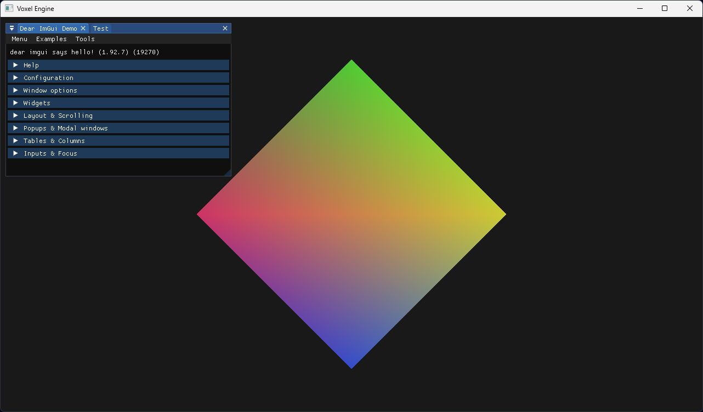

# Voxel Engine

A simple game engine in C++

## Requirements

- CMake 3.20 or newer
- C++20
- OpenGL 4.5 or newer
- A C++ compiler (GCC, Clang, MSVC)

## Build Instructions

1. Clone the repository

```bash
git clone https://github.com/nixuh3/Voxel-Engine.git
cd Voxel-Engine
```

2. Configure project

```bash
cmake -S . -B build
```

3. Build

```bash
cmake --build build
```

4. Run

```bash
./build/Sandbox/Debug/Sandbox
```

## Screenshots


